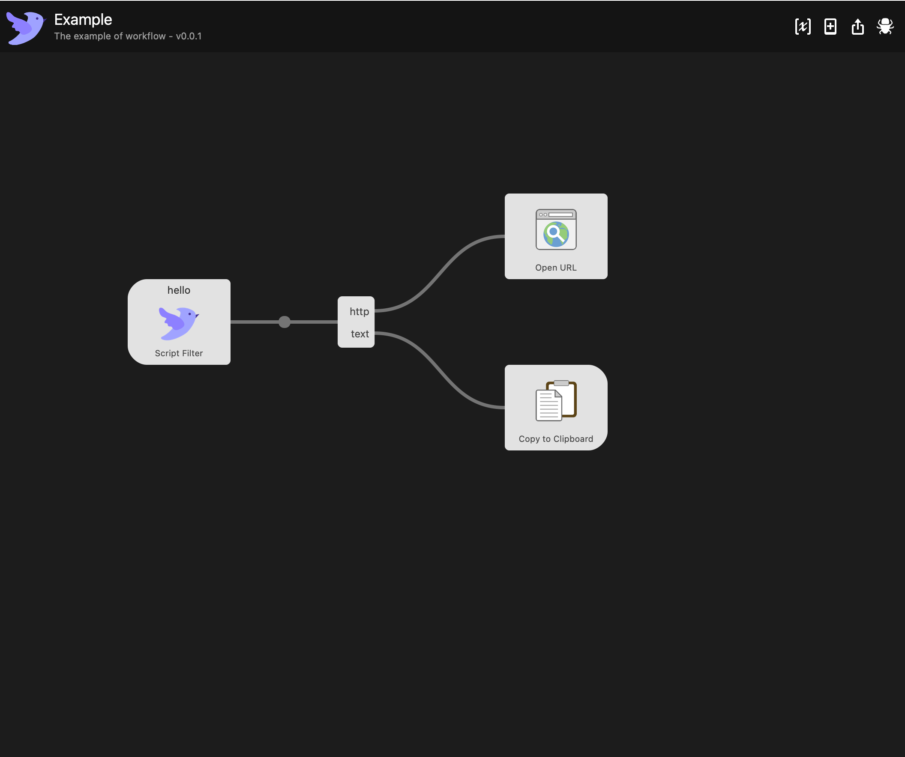
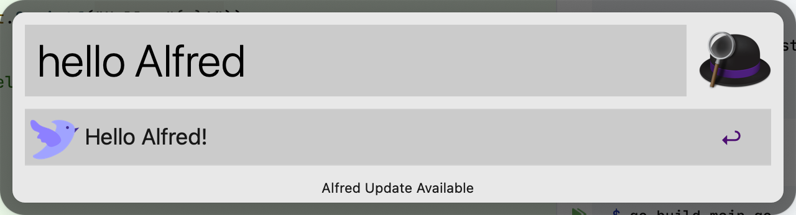

# alfred-workflow-go

## Quick start

Simple application:

```go
// main.go

package main

import (
	"fmt"
	"github.com/pushyzheng/alfred-workflow-go"
)

func Foo(wf *alfred.Workflow) {
	if q, ok := wf.GetQuery(); ok {
		wf.AddTitleItem(fmt.Sprintf("Hello %s!", q))
	} else {
		wf.AddTitleItem("Hello World!")
	}
}

func main() {
	alfred.Run()
}

func init() {
	alfred.RegisterView("foo", Foo)
}

```

the run command:

```shell
$ go build main.go
$ ./main -cmd foo -query Golang
```

Open the 'AlfredWorkflowExample.alfredworkflow' file in project root dir, import it into Alfred, and then move the
compiled program to the Workflow directory:



Open Alfred window and enter content: hello(cmd) + Alfred(args), like this:


